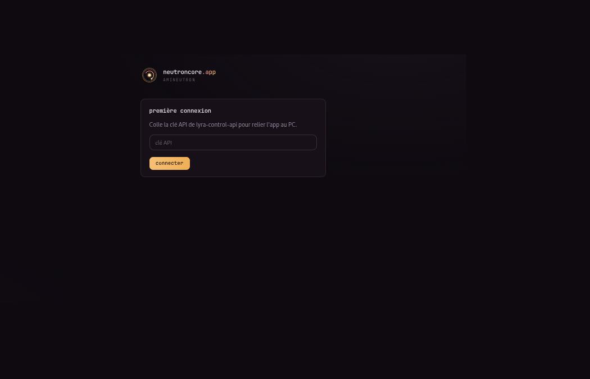
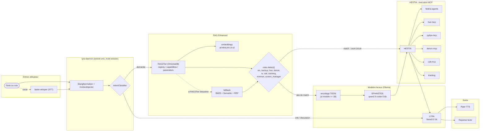

# Lyra

Assistant vocal DevOps **100% local** — pas d'API cloud, pas de facture. Tu lui parles (ou tu lui écris) en français, il gère tes VMs, tes backups, ta TV, tes lumières. Tout tourne sur ta machine : LLM via Ollama, reconnaissance vocale, synthèse vocale.

Née comme copilote pour gérer un homelab (KVM, backups, domotique), Lyra s'appuie sur un pipeline RAG à 3 niveaux + un routage à base de règles pour éviter d'interroger un LLM à chaque requête triviale — résultat : des réponses en dessous de la seconde une fois le démon chaud.

## Un aperçu

Lyra a une petite sœur web : [neutroncore.app](docs/assets/neutroncore-app.jpg), un hub PWA qui permet de discuter avec elle depuis le navigateur (mobile compris), avec le même thème visuel — palette or/rose "réacteur" reprise directement dans l'installeur en ligne de commande.



## Fonctionnalités

- **VMs KVM** : démarrer, arrêter, cloner, snapshots, exécution de commandes, vérification de clones
- **Backups** : status, liste, création, restauration, vérification, nettoyage (Timeshift/Borg/snapshot)
- **Domotique** : TV Philips (power, volume, Ambilight, apps, YouTube Premium sans pubs via ADB), lumières Hue (couleurs, scènes, groupes), Chromecast (catt), home cinéma Denon
- **Mode vocal** : STT (faster-whisper) + TTS (Piper), 6 voix françaises au choix
- **Mode performance** : domotique sans confirmation (latence < 200ms) — jamais pour VM/backup
- **Human-in-the-loop** : confirmation obligatoire avant toute action sensible, todo-list pour les actions multiples
- **Opérations async** : clone VM, backups longs exécutés en arrière-plan avec notification
- **Démon résident** : sessions multiples, pipeline RAG déjà chaud, ~0.3-1s par requête une fois lancé

## Démo

```
Toi: clone preprod-09 vers sandbox-01 et sandbox-02

[i] Todo list: 2 actions proposees
==================================================
  [1] vm_clone -> sandbox-01
  [2] vm_clone -> sandbox-02
==================================================

Executer ? [T]out / [1] par 1 / [n]on : t

[i] [1/2] vm_clone -> sandbox-01
[+] Operation lancee en arriere-plan.
[i] [2/2] vm_clone -> sandbox-02
[+] Operation lancee en arriere-plan.

[+] Todo list terminee: 2/2 actions
```

## Démarrage rapide

```bash
git clone git@github.com:marouabah/lyra.git && cd lyra
./installer/install.sh
```

L'installeur (TUI Rich interactif, ou `--app` pour une version graphique locale) détecte ta distro (Fedora/Debian/Arch), installe les dépendances système, crée le venv, télécharge Piper + une voix française, installe le client Ollama et pull deux modèles légers par défaut — **`qwen2.5-coder:0.5b`** et **`llama3.2:1b`**, environ **4 Go de VRAM** au total. Ça tourne sans GPU dédié : `--ollama-host <ip>` pointe vers une machine distante qui héberge Ollama (validé aujourd'hui en conditions réelles sur 3 VMs Fedora/Ubuntu/Arch sans aucun GPU).

Aucune commande à copier-coller à la main pour les permissions sudo — l'installeur génère lui-même les règles `sudoers` pour ton utilisateur, pas un nom codé en dur.

### Utilisation

```bash
lyra                          # mode texte interactif
lyra --vocal                  # mode vocal (STT/TTS)
lyra -p                       # mode performance (domotique sans confirmation)
lyra "demarre preprod-09"     # one-shot, sans interface
lyra -y "liste mes VMs"       # one-shot, confirmation auto
```

## Architecture

Chaque requête traverse le démon `lyra-daemon` (socket Unix, pipeline RAG déjà chargé en mémoire, plusieurs sessions en parallèle). Le RAG à 3 niveaux (registry / capabilities / parameters dans ChromaDB) retrouve les outils MCP pertinents ; un système de règles déterministes (`lyra/rules/`) court-circuite EPHAISTOS pour les cas fréquents et fiables ; sinon EPHAISTOS extrait les arguments (avec un encodage TOON qui compresse les specs d'environ 40 % — sauté si le modèle fait moins d'1B, il ne le comprend pas encore) ; LYRA porte la conversation et le ton ; HESTIA exécute et route vers le bon serveur MCP.



## Les mascottes et les divinités — la direction artistique

Lyra emprunte sa palette (or `#f6c177`, rose `#eb6f92`, "thème réacteur") à [neutroncore.app](docs/assets/neutroncore-app.jpg) — les deux partagent la même identité visuelle. Ce n'est pas juste un logo : la ligne de commande hérite du même soin.

**Les modèles portent des noms de divinités grecques, pas par hasard :**
- **HESTIA** — déesse du foyer, gardienne de la maison. Dans le code : *"Elle exécute les tâches domestiques (MCP) avec soin."* C'est elle qui parle aux serveurs MCP et garde la maison (le homelab) en ordre.
- **EPHAISTOS** — dieu forgeron, artisan des dieux. Il forge les arguments à partir des specs MCP brutes — le même patronyme que le projet "forge d'agents" prévu pour la suite de Lyra.
- **LYRA** — l'instrument d'Apollon, la voix et l'harmonie. C'est elle qui porte le dialogue, le ton, la personnalité.

**Les mascottes de l'installeur** : 30 créatures ASCII animées (`installer/assets/mascots.json`), réparties en deux familles selon la vitesse d'une étape — *fast* (bolt, comet, atom, pinwheel, radar, rocket, firefly, spark, dart…) pour les étapes rapides, *slow* (owl, cat, turtle, golem, whale, wizard, moon…) pour celles qui prennent leur temps. Chacune a un rôle écrit à la main :

> *owl — "Le hibou : observe longtemps avant de répondre."*
> *comet — "Toujours en mouvement, la traînée raconte d'où elle vient."*
> *golem — "Le golem : la pierre qui pense. Seuls ses yeux bougent."*

Une mascotte est piquée au hasard dans la famille correspondante à chaque étape de l'installeur — une manière de rendre un process forcément un peu long (téléchargements, pip, modèles) plus vivant à regarder.

## Métriques

| Mesure | Valeur |
|---|---|
| Tests unitaires | **975** verts (`pytest tests/unit/`) |
| Pipeline one-shot (démon chaud) | 17.1s → **1.3s** |
| REPL prêt | 20s → **0.25s** |
| Requête chaude (démon déjà lancé) | **0.3–1s** |
| VRAM (mode expérimental, actuel) | **~4 Go** (0.5b + 1b + embeddings) |
| VRAM (mode production, backup) | ~10.5 Go (7b + 3b + embeddings) |
| Outils MCP disponibles | **85**, répartis sur 6 intégrations |
| TTS (Piper, toutes voix) | **< 0.6s** par phrase |
| Installeur validé en réel | Fedora, Ubuntu, Arch — sans GPU |

## Intégrations MCP

Catalogue déclaratif (`installer/core/catalog.yaml`), sélectionnable à l'installation :

| MCP | Rôle | Dépôt |
|---|---|---|
| `fedora-agents` | VMs KVM + backups (17 outils) | public |
| `hue-mcp` | Lumières Philips Hue | public |
| `pylips-mcp` | TV Philips (JointSpace + ADB) | public |
| `denon-mcp` | Home cinéma Denon AVR (telnet) | public |
| `catt-mcp` | Cast Chromecast/YouTube | public |
| `tracking` | Suivi des opérations longues | intégré |

Ces dépôts MCP sont publics mais taillés pour ma domotique — le cœur de Lyra (dialogue, RAG, démon, mode texte) fonctionne très bien avec **zéro MCP sélectionné**, testé aujourd'hui même. Envie d'écrire ton propre serveur MCP pour ta propre domotique ? Une entrée YAML dans `catalog.yaml` suffit (voir `installer/README.md`).

## Sécurité

- **Human-in-the-loop** : confirmation obligatoire avant toute action, jamais auto-confirmée en mode performance pour VM/backup
- **Read-first** : vérification de l'état réel avant d'agir
- **Actions destructives signalées en rouge** : `vm_destroy`, `backup_restore`, `backup_clean`
- **100 % local** : aucune donnée envoyée à un service tiers, aucune clé API cloud requise
- **Secrets jamais dans `config.yaml`** : credentials TV, pairing Hue, tokens GitHub temporaires — tout passe par `secrets.yaml` (chmod 600) ou reste en mémoire le temps du run

## Configuration

Extrait de `config.yaml` (généré par l'installeur, jamais commité) :

```yaml
models:
  ephaistos:
    name: "qwen2.5-coder:0.5b"   # analyse/arguments — leger, actif par defaut
  lyra:
    name: "llama3.2:1b"          # dialogue/personnalite — leger, actif par defaut

audio:
  sample_rate: 48000
  silence_duration: 1.0

stt:
  model: base
  language: fr

tts:
  model: fr_FR-upmc-medium
```

## Licence

[MIT](LICENSE)
