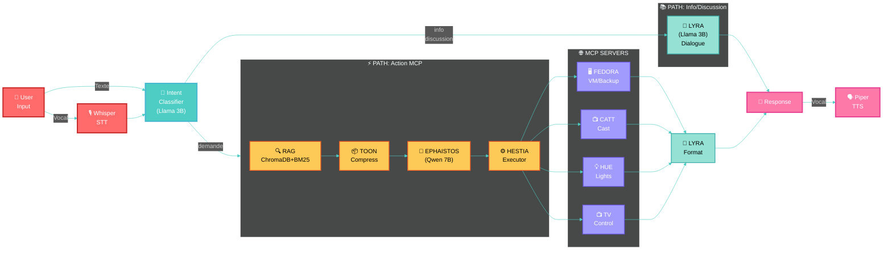
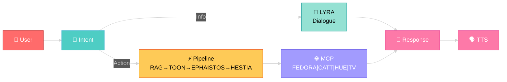

# Architecture Lyra - Diagramme Mermaid

Ce diagramme représente l'architecture complète de Lyra RAG V2.



---

## Version simplifiée (ultra-clean)



## Légende des composants

| Couleur | Layer | Composants |
|---------|-------|------------|
| 🔴 Rouge | Input | User, Whisper STT |
| 🔵 Cyan | Intent | IntentClassifier (Llama 3B) |
| 🟢 Vert | Knowledge | LYRA Voice (dialogue) |
| 🟡 Jaune | Action | RAG, TOON, EPHAISTOS, HESTIA |
| 🟣 Violet | MCP | FEDORA, CATT, HUE, TV |
| 🔴 Rose | Output | Response, Piper TTS |
| 🔵 Bleu | Storage | ChromaDB, BM25, SessionMemory |

## Flux de données

- **Ligne pleine** → Flux principal de données
- **Ligne pointillée** → Contexte et mémoire

## Ressources VRAM (~10.5 GB)

- EPHAISTOS (Qwen 7B): ~5 GB
- LYRA (Llama 3B): ~2.5 GB
- Embeddings: ~0.5 GB
- Whisper: ~1.5 GB

## Comment visualiser ce diagramme

### Option 1 : VSCode avec extension Mermaid
1. Installe l'extension "Markdown Preview Mermaid Support"
2. Ouvre ce fichier dans VSCode
3. Appuie sur `Ctrl+Shift+V` pour le preview Markdown

### Option 2 : En ligne
1. Va sur https://mermaid.live/
2. Copie-colle le code Mermaid (entre les ``` ````)
3. Le diagramme s'affiche automatiquement

### Option 3 : GitHub/GitLab
Les plateformes Git supportent nativement Mermaid dans les fichiers .md

### Option 4 : Mermaid CLI
```bash
npm install -g @mermaid-js/mermaid-cli
mmdc -i docs/ARCHITECTURE_DIAGRAM.md -o docs/architecture.png
```
