# 📐 Mermaid - Guide des Bonnes Pratiques

Guide de conception pour créer des diagrammes Mermaid clairs, lisibles et professionnels.

---

## 🎯 Règles d'Or

### 1. Direction du flux → **Toujours vers l'avant**

✅ **BON** : Flux linéaire de gauche à droite
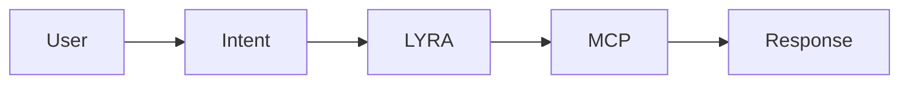

❌ **MAUVAIS** : Flèches qui reviennent en arrière (confusion)
```mermaid
graph LR
    A[User] --> B[Intent]
    B --> C[LYRA]
    C --> B  ❌ Retour arrière confus
    B --> D[Response]
```

**Solution pour les boucles** : Utiliser des labels explicites
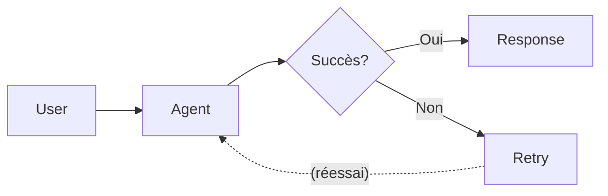

### 2. Orientation → **LR (Left-Right) par défaut**

✅ **BON** : `graph LR` pour flux de processus
- Plus naturel à lire (comme un texte)
- Meilleur usage de l'espace écran (format paysage)

⚠️ **TB (Top-Bottom)** : Réserver pour hiérarchies/organigrammes
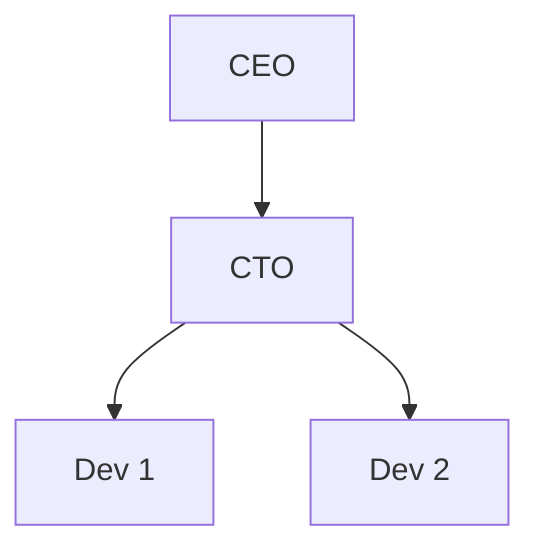

### 3. Nommage des nœuds → **ID courts + Labels descriptifs**

✅ **BON** : IDs courts, labels explicites
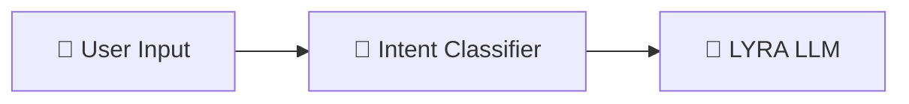

❌ **MAUVAIS** : IDs longs ou labels vagues
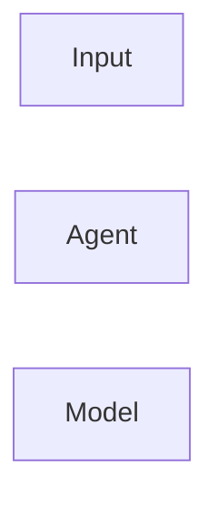

**Convention recommandée** :
- **IDs** : 3-5 caractères (ex: `usr`, `int`, `lyra`, `mcp1`)
- **Labels** : Emoji + Nom clair + Contexte optionnel
  - Exemple : `"🎯 Intent<br/>Classifier<br/>(Llama 3B)"`

### 4. Couleurs → **Cohérence sémantique**

Définir une palette cohérente pour tout le projet :

| Catégorie | Couleur | Usage |
|-----------|---------|-------|
| **Input** | 🔴 `#ff6b6b` | Entrées utilisateur, données externes |
| **Processing** | 🔵 `#4ecdc4` | Traitement, analyse, décisions |
| **AI/LLM** | 🟢 `#95e1d3` | Modèles LLM, agents intelligents |
| **Action** | 🟡 `#feca57` | Exécution, modifications, API calls |
| **External** | 🟣 `#a29bfe` | Services externes, MCP, bases de données |
| **Output** | 🔴 `#fd79a8` | Résultats, réponses, outputs |
| **Error** | 🔴 `#d63031` | Erreurs, exceptions |
| **Optional** | ⚪ `#b2bec3` | Chemins optionnels, fallbacks |

**Exemple d'application** :
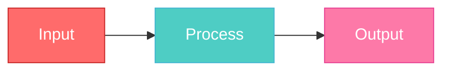

### 5. Emojis → **1 par nœud maximum**

✅ **BON** : Emoji au début du label
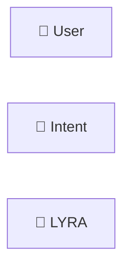

❌ **MAUVAIS** : Trop d'emojis (surcharge visuelle)
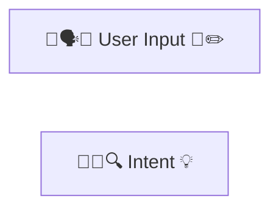

**Emojis recommandés** :
- 👤 User, Utilisateur
- 🎙️ STT, Microphone, Audio
- 🎯 Intent, Classification, Décision
- 🤖 IA, LLM, Agent
- 🔧 Backend, Processing, Analyse
- ⚙️ Execution, Runtime
- 🔌 MCP, API, Services
- 💾 Storage, Database, Cache
- 💻 VM, Server, Host
- 💡 Lumières, Hue
- 📺 TV, Display
- 📦 Package, Module, Composant
- 🔍 Search, RAG, Retrieval
- 🗣️ TTS, Sortie vocale
- ✅ Succès, Validation
- ❌ Erreur, Échec

### 6. Labels des liens → **Courts et explicites**

✅ **BON** : Labels courts (1-3 mots)
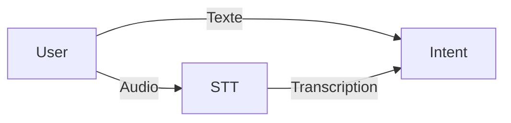

❌ **MAUVAIS** : Labels trop longs
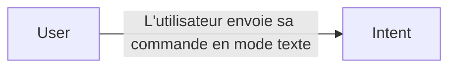

⚠️ **Labels optionnels** : Ne pas en abuser
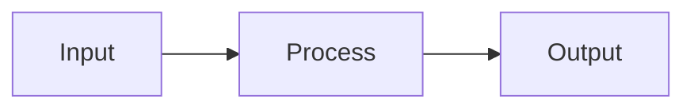

### 7. Sous-graphes → **Grouper logiquement**

✅ **BON** : Regrouper par responsabilité
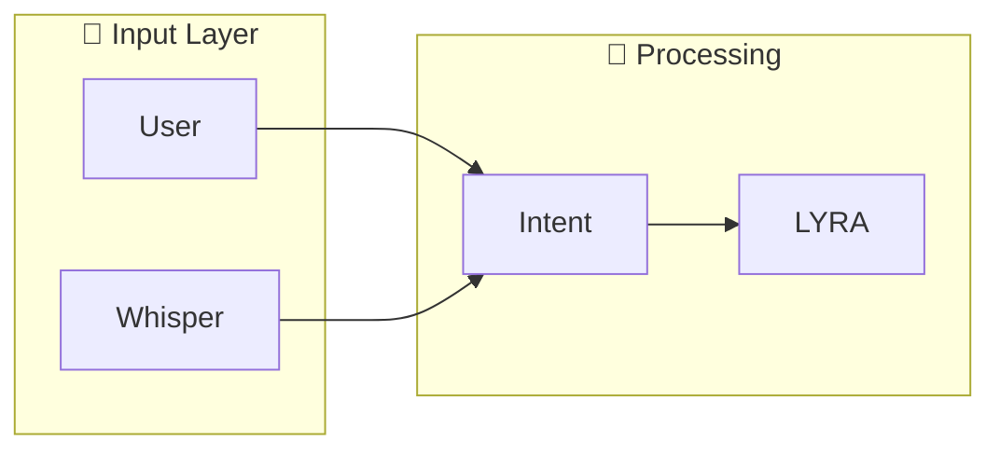

**Conventions** :
- Nom de sous-graphe en MAJUSCULES : `INPUT`, `PROCESS`, `OUTPUT`
- Titre avec emoji : `"🎤 Input Layer"`
- 3-5 nœuds max par sous-graphe

### 8. Complexité → **Diviser si > 15 nœuds**

Si ton diagramme dépasse **15 nœuds**, considère :

**Option A** : Créer plusieurs vues
- Vue globale (high-level)
- Vues détaillées par composant

**Option B** : Utiliser des sous-graphes
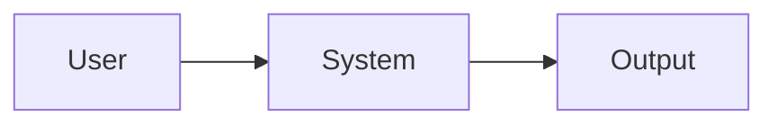

**Option C** : Créer un diagramme simplifié + diagramme complet
- `architecture_simple.mmd` : Vue d'ensemble (5-7 nœuds)
- `architecture_complete.mmd` : Tous les détails

### 9. Contraste → **Lisibilité avant tout**

✅ **BON** : Texte lisible sur fond
- Texte blanc (`color:#fff`) sur fond foncé
- Texte noir (`color:#000`) sur fond clair
- `stroke-width: 2-3px` pour visibilité

❌ **MAUVAIS** : Faible contraste
```mermaid
classDef badStyle fill:#777,color:#888  ❌ Illisible
```

**Test de contraste** : Ratio minimum 4.5:1 (WCAG AA)

### 10. Types de flèches → **Sémantique claire**

| Flèche | Usage | Exemple |
|--------|-------|---------|
| `-->` | Flux principal, synchrone | `A --> B` |
| `-.->` | Flux optionnel, asynchrone | `A -.-> B` |
| `==>` | Flux important, critique | `A ==> B` |
| `--x` | Blocage, échec | `A --x B` |
| `--o` | Boucle, callback | `A --o B` |

**Exemple** :
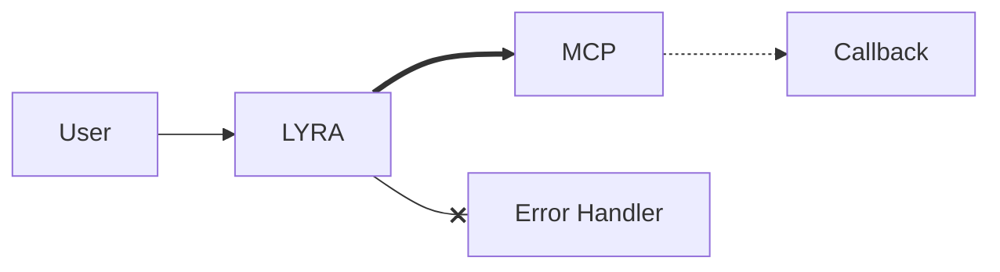

### 11. Modèles & Technologies → **Toujours préciser**

✅ **BON** : Indiquer le modèle LLM et les technos clés
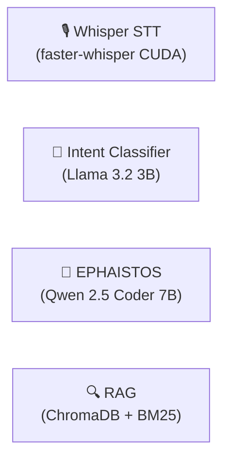

❌ **MAUVAIS** : Labels vagues sans contexte technique
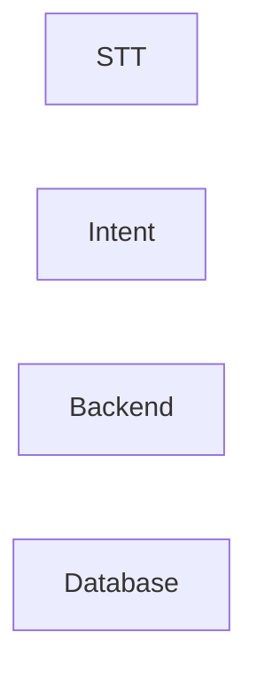

**Quand préciser les technos** :
- **IA/LLM** : TOUJOURS indiquer modèle + taille
  - Ex: `"LYRA (Llama 3.2 3B)"`, `"EPHAISTOS (Qwen 7B)"`
- **Bases de données** : Type + nom
  - Ex: `"ChromaDB (Vector DB)"`, `"PostgreSQL"`
- **APIs externes** : Service + version si pertinent
  - Ex: `"Philips Hue API v2"`, `"OpenAI GPT-4"`
- **Processing** : Framework/librairie si important
  - Ex: `"Whisper (CUDA)"`, `"FastAPI"`

**Format recommandé** :
```
"[Emoji] [Nom]<br/>([Techno/Modèle] [Version/Taille])"
```

### 12. Légendes → **OBLIGATOIRE pour diagrammes techniques**

✅ **TOUJOURS inclure une légende** pour :
- Couleurs et leur signification
- Conventions de flèches
- Technologies utilisées (optionnel mais recommandé)

**Légende minimale** (via `MermaidViewer.create_legend()`):
```python
colors = {
    "Input": {"color": "#ff6b6b", "description": "User, Whisper STT"},
    "Processing": {"color": "#4ecdc4", "description": "Intent, LYRA"},
    "AI Models": {"color": "#95e1d3", "description": "Llama 3B, Qwen 7B"},
    "External": {"color": "#a29bfe", "description": "MCP Servers"},
    "Output": {"color": "#fd79a8", "description": "Response, TTS"}
}

legend = viewer.create_legend(colors)
```

**Légende complète** (avec technos):
```python
info_tech = viewer.create_info_section(
    title="🔧 Stack Technique",
    content="""
    <ul>
        <li><strong>LLM Backend</strong>: Qwen 2.5 Coder 7B (EPHAISTOS)</li>
        <li><strong>LLM Frontend</strong>: Llama 3.2 3B (LYRA)</li>
        <li><strong>STT</strong>: faster-whisper (CUDA)</li>
        <li><strong>TTS</strong>: Piper (fr_FR-upmc-medium)</li>
        <li><strong>RAG</strong>: ChromaDB + BM25</li>
        <li><strong>Embeddings</strong>: all-MiniLM-L6-v2</li>
    </ul>
    """,
    icon="🔧"
)
```

**Quand créer une légende** :
- ✅ **TOUJOURS** si > 3 couleurs
- ✅ **TOUJOURS** si diagramme partagé/documenté
- ✅ **TOUJOURS** si technos spécifiques (LLMs, APIs, etc.)
- ⚠️ Optionnel si diagramme très simple (< 5 nœuds, 1 couleur)

**Placement de la légende** :
- Après le diagramme (via `extra_content`)
- Dans le même fichier HTML
- Section séparée mais visible sans scroll si possible

---

## 📋 Checklist avant publication

Avant de publier un diagramme, vérifier :

- [ ] ✅ Flux de gauche à droite (ou justifié si TB)
- [ ] ✅ Pas de flèches qui reviennent en arrière sans label
- [ ] ✅ IDs courts (3-5 chars) + Labels explicites
- [ ] ✅ Palette cohérente (max 6 couleurs)
- [ ] ✅ 1 emoji max par nœud
- [ ] ✅ Labels de liens courts (1-3 mots)
- [ ] ✅ Sous-graphes logiques (si > 5 nœuds)
- [ ] ✅ Moins de 15 nœuds (sinon diviser)
- [ ] ✅ Contraste texte/fond > 4.5:1
- [ ] ✅ Type de flèche approprié
- [ ] ✅ **Modèles LLM précisés** (ex: Llama 3B, Qwen 7B)
- [ ] ✅ **Technologies clés indiquées** (si pertinent)
- [ ] ✅ **Légende fournie** (couleurs + conventions + stack tech si demandé)
- [ ] ✅ **User début ET fin** (INPUT + OUTPUT, pas de boucle)
- [ ] ✅ **Layout INPUT/OUTPUT** (Input à gauche, Output à droite)
- [ ] ✅ **Descriptions sous-graphes** (Explications brèves si > 3 nœuds)

---

### 13. User au début ET à la fin → **PAS de boucle !**

✅ **RÈGLE D'OR** : User dans INPUT (gauche) ET OUTPUT (droite)

**Pourquoi ?**
- Montre clairement début et fin du flux
- Évite les flèches de retour (boucles visuelles)
- Plus lisible que les boucles

✅ **BON** : User 2 fois (pas de flèche retour)
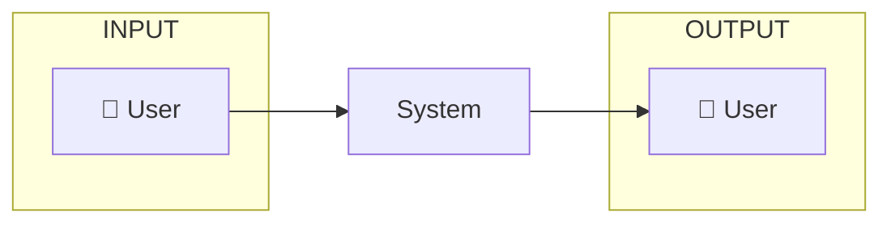

❌ **MAUVAIS** : User 1 fois avec boucle
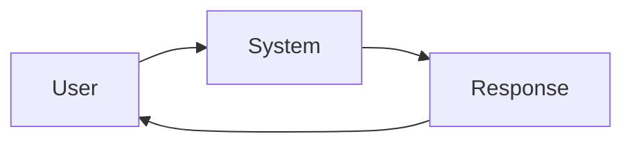

**Format recommandé** :
- INPUT : Contient User (début)
- OUTPUT : Contient User (fin)
- Pas de flèche de retour

### 14. Layout INPUT/OUTPUT → **Gauche à droite**

✅ **RÈGLE D'OR** : INPUT à gauche, OUTPUT à droite

**Pourquoi ?**
- Suit le sens de lecture naturel (LR)
- Cohérence avec la direction du flux
- Meilleure compréhension visuelle

✅ **BON** : INPUT gauche, OUTPUT droite
```mermaid
graph LR
    subgraph INPUT["🎤 INPUT"]
        user["User"]
    end

    subgraph PROCESSING["⚙️ PROCESSING"]
        system["System"]
    end

    subgraph OUTPUT["💭 OUTPUT"]
        response["Response"]
    end

    INPUT --> PROCESSING --> OUTPUT
```

❌ **MAUVAIS** : Ordre incohérent
```mermaid
graph LR
    subgraph OUTPUT["OUTPUT"]
        response["Response"]
    end

    subgraph INPUT["INPUT"]
        user["User"]
    end

    %% OUTPUT avant INPUT !
```

**Ordre recommandé des sous-graphes** :
1. **INPUT** (extrême gauche) - TOUJOURS en premier dans le code
2. PROCESSING/CORE/LOGIC (centre)
3. EXTERNAL/MCP/STORAGE (selon besoin)
4. **OUTPUT** (extrême droite) - TOUJOURS en dernier dans le code

**IMPORTANT** : L'ordre dans le code Mermaid influence la position visuelle !
- Premier subgraph déclaré = gauche
- Dernier subgraph déclaré = droite

### 15. Descriptions sous-graphes → **Ajouter si complexe**

✅ **Ajouter une description** pour chaque sous-graphe avec > 3 nœuds

**Format** :
```
subgraph ID["Titre<br/><small>Description brève</small>"]
```

**Exemple** :
```mermaid
graph LR
    subgraph ACTION["⚡ ACTION<br/><small>Pipeline de traitement des actions</small>"]
        rag["RAG"]
        toon["TOON"]
        eph["EPHAISTOS"]
    end
```

**Règles pour les descriptions** :
- ✅ 1 ligne max (< 50 caractères)
- ✅ Explique le rôle du groupe
- ✅ Utiliser `<small>` pour la description
- ✅ Éviter les chevauchements avec les nœuds

---

## 🎨 Template de base recommandé

```mermaid
%%{init: {'theme':'dark', 'themeVariables': {
    'primaryColor':'#ff6b6b',
    'secondaryColor':'#4ecdc4',
    'tertiaryColor':'#a29bfe'
}}}%%

graph LR
    %% === NODES (avec modèles/technos) ===
    usr["👤 User"]
    int["🎯 Intent<br/>(Llama 3.2 3B)"]
    llm["🤖 LYRA<br/>(Llama 3B)"]
    mcp["🔌 MCP Servers"]
    out["💭 Response"]

    %% === FLOW ===
    usr --> int
    int --> llm
    llm --> mcp
    mcp --> out

    %% === STYLES ===
    classDef inputStyle fill:#ff6b6b,stroke:#c92a2a,stroke-width:3px,color:#fff
    classDef processStyle fill:#4ecdc4,stroke:#45b7d1,stroke-width:3px,color:#fff
    classDef externalStyle fill:#a29bfe,stroke:#6c5ce7,stroke-width:2px,color:#fff
    classDef outputStyle fill:#fd79a8,stroke:#e84393,stroke-width:3px,color:#fff

    class usr inputStyle
    class int,llm processStyle
    class mcp externalStyle
    class out outputStyle
```

**+ Légende à générer** :
```python
colors = {
    "Input": {"color": "#ff6b6b", "description": "Utilisateur"},
    "Processing": {"color": "#4ecdc4", "description": "Intent, LYRA (Llama 3B)"},
    "External": {"color": "#a29bfe", "description": "Serveurs MCP"},
    "Output": {"color": "#fd79a8", "description": "Réponse"}
}
legend = viewer.create_legend(colors)
```

---

## 🚫 Anti-patterns à éviter

### ❌ Le "plat de spaghetti"
Trop de connexions croisées → Illisible

**Solution** : Diviser en couches ou sous-systèmes

### ❌ Le "sapin de Noël"
Trop de couleurs différentes → Confusion

**Solution** : Max 5-6 couleurs, palette cohérente

### ❌ Le "roman"
Labels trop longs → Surcharge cognitive

**Solution** : Labels courts + documentation séparée

### ❌ Le "labyrinthe"
Flèches dans tous les sens → Désorientation

**Solution** : Flux linéaire, sous-graphes hiérarchiques

---

## 📚 Ressources

- **Mermaid Live Editor** : https://mermaid.live
- **Documentation officielle** : https://mermaid.js.org
- **Contrast Checker** : https://webaim.org/resources/contrastchecker/
- **Emoji Picker** : https://emojipedia.org

---

## 💡 Exemples annotés

### Exemple 1 : Flux simple (PARFAIT)

```mermaid
graph LR
    A["👤 User"] --> B["🎯 Intent"]
    B --> C["🤖 LYRA"]
    C --> D["💭 Response"]

    classDef clean fill:#4ecdc4,stroke:#45b7d1,color:#fff
    class A,B,C,D clean
```

**Pourquoi c'est parfait** :
- ✅ LR (lisibilité)
- ✅ IDs courts (A,B,C,D)
- ✅ 1 emoji par nœud
- ✅ Flux linéaire
- ✅ Couleur unique (pas de surcharge)

### Exemple 2 : Flux avec branchement (BON)

```mermaid
graph LR
    A["👤 User"] --> B["🎯 Intent"]
    B -->|Info| C1["💬 LYRA"]
    B -->|Action| C2["🔧 EPHAISTOS"]

    C1 --> D["💭 Response"]
    C2 --> E["🔌 MCP"]
    E --> D

    classDef input fill:#ff6b6b,stroke:#c92a2a,color:#fff
    classDef process fill:#4ecdc4,stroke:#45b7d1,color:#fff
    classDef output fill:#fd79a8,stroke:#e84393,color:#fff

    class A input
    class B,C1,C2 process
    class D output
```

**Pourquoi c'est bon** :
- ✅ Branchement clair avec labels
- ✅ Convergence vers un seul output
- ✅ Couleurs sémantiques (entrée/traitement/sortie)

### Exemple 3 : Architecture complète (EXCELLENT)

```mermaid
graph LR
    subgraph INPUT["🎤 INPUT"]
        usr["👤 User"]
        stt["🎙️ STT"]
    end

    subgraph CORE["🧠 CORE"]
        int["🎯 Intent"]
        lyra["💬 LYRA"]
        ephai["🔧 EPHAISTOS"]
    end

    subgraph EXEC["⚙️ EXECUTION"]
        hestia["⚙️ HESTIA"]
        mcp["🔌 MCP"]
    end

    usr --> int
    stt --> int
    int --> lyra
    int --> ephai
    ephai --> hestia
    hestia --> mcp
    mcp --> lyra

    classDef inputS fill:#ff6b6b,stroke:#c92a2a,color:#fff
    classDef coreS fill:#4ecdc4,stroke:#45b7d1,color:#fff
    classDef execS fill:#a29bfe,stroke:#6c5ce7,color:#fff

    class usr,stt inputS
    class int,lyra,ephai coreS
    class hestia,mcp execS
```

**Pourquoi c'est excellent** :
- ✅ Sous-graphes logiques (3 couches)
- ✅ Séparation claire des responsabilités
- ✅ Flux cohérent (input → core → exec)
- ✅ Couleurs par couche

### Exemple 4 : Avec modèles & technos + légende (PARFAIT)

```mermaid
graph LR
    subgraph INPUT["🎤 INPUT"]
        usr["👤 User"]
        stt["🎙️ Whisper STT<br/>(faster-whisper CUDA)"]
    end

    subgraph CORE["🧠 CORE"]
        int["🎯 Intent<br/>(Llama 3.2 3B)"]
        lyra["💬 LYRA<br/>(Llama 3B)"]
        ephai["🔧 EPHAISTOS<br/>(Qwen 2.5 Coder 7B)"]
    end

    subgraph DATA["💾 DATA"]
        rag["🔍 RAG<br/>(ChromaDB + BM25)"]
        toon["📦 TOON<br/>Encoder"]
    end

    subgraph EXEC["⚙️ EXECUTION"]
        hestia["⚙️ HESTIA"]
        mcp["🔌 MCP Servers"]
    end

    usr --> int
    stt --> int
    int --> lyra
    int --> ephai
    ephai --> rag
    rag --> toon
    toon --> hestia
    hestia --> mcp
    mcp --> lyra

    classDef inputS fill:#ff6b6b,stroke:#c92a2a,color:#fff
    classDef coreS fill:#4ecdc4,stroke:#45b7d1,color:#fff
    classDef dataS fill:#95e1d3,stroke:#38ada9,color:#000
    classDef execS fill:#a29bfe,stroke:#6c5ce7,color:#fff

    class usr,stt inputS
    class int,lyra,ephai coreS
    class rag,toon dataS
    class hestia,mcp execS
```

**+ Légende complète** :
```python
# Couleurs
colors = {
    "Input": {"color": "#ff6b6b", "description": "User, Whisper STT"},
    "Core": {"color": "#4ecdc4", "description": "Intent, LYRA, EPHAISTOS"},
    "Data": {"color": "#95e1d3", "description": "RAG, TOON"},
    "Execution": {"color": "#a29bfe", "description": "HESTIA, MCP"}
}

# Stack technique
tech = viewer.create_info_section(
    title="🔧 Stack Technique",
    content="""
    <ul>
        <li><strong>Intent Classifier</strong>: Llama 3.2 3B</li>
        <li><strong>LYRA (Frontend)</strong>: Llama 3.2 3B</li>
        <li><strong>EPHAISTOS (Backend)</strong>: Qwen 2.5 Coder 7B</li>
        <li><strong>STT</strong>: faster-whisper (CUDA)</li>
        <li><strong>RAG</strong>: ChromaDB + BM25</li>
        <li><strong>TOON</strong>: Token encoder (~40% compression)</li>
    </ul>
    """
)

# Ressources VRAM
vram = viewer.create_info_section(
    title="💾 Ressources VRAM (~10.5 GB)",
    content="""
    <ul>
        <li>EPHAISTOS (Qwen 7B): ~5 GB</li>
        <li>LYRA (Llama 3B): ~2.5 GB</li>
        <li>Embeddings: ~0.5 GB</li>
        <li>Whisper: ~1.5 GB</li>
    </ul>
    """
)

extra_content = legend + tech + vram
```

**Pourquoi c'est PARFAIT** :
- ✅ Tous les modèles LLM précisés avec taille
- ✅ Technologies clés indiquées (CUDA, ChromaDB, BM25)
- ✅ Légende complète avec couleurs
- ✅ Section stack technique séparée
- ✅ Infos ressources (VRAM) si pertinent
- ✅ Architecture claire en 4 couches

### 16. INPUT/OUTPUT → **3 GRILLES strictes (gauche | centre | droite)**

✅ **RÈGLE D'OR ABSOLUE** : Le diagramme doit avoir exactement **3 GRILLES alignées HORIZONTALEMENT** :
1. **GRILLE GAUCHE (INPUT)** : Bloc à gauche absolue, même hauteur que CENTRE
2. **GRILLE CENTRE** : Bloc central avec TOUS les éléments
3. **GRILLE DROITE (OUTPUT)** : Bloc à droite absolue, même hauteur que CENTRE

**PROBLÈME CRITIQUE** :
- Les 3 grilles doivent être disposées **HORIZONTALEMENT** (côte à côte sur la LONGUEUR)
- Les 3 grilles doivent avoir **la même HAUTEUR** (verticale)
- **RIEN ne doit être au-dessus ni en-dessous** des grilles INPUT et OUTPUT
- Les grilles sont séparées horizontalement, PAS empilées verticalement

**SOLUTION OBLIGATOIRE : 3 grilles compactes** :

⚠️ **RÈGLE DE COMPACITÉ** : Si trop d'éléments → Mermaid les empile et casse le layout
- **Maximum recommandé** : 8-10 nœuds par grille
- **Si > 10 nœuds** : Grouper/simplifier (ex: 5 serveurs MCP → 1 nœud "MCP")
- **Contrôle qualité** : Vérifier visuellement qu'aucun élément n'est au-dessus d'un autre

**Étape 1** : Respecter la limite de nœuds
```
Maximum : 8-10 nœuds par grille (CENTRE)
INPUT : 2 nœuds (User, Whisper STT)
OUTPUT : 1 nœud (User)
```

**Étape 2** : Grouper si nécessaire
- Si > 10 nœuds dans CENTRE → grouper les éléments similaires
- Exemple : MCP (5 serveurs) → 1 nœud "MCP (5 serveurs)"
- Exemple : Storage (3 bases) → 1 nœud "Storage (3 bases)"

**Étape 3** : Structure simple avec `direction TB`
- Pas besoin d'espaceurs ou de connexions `~~~`
- Utiliser `direction TB` dans chaque subgraph
- Laisser Mermaid disposer naturellement les nœuds

**TEMPLATE OBLIGATOIRE - VERSION COMPACTE (qui fonctionne)** :

```mermaid
graph LR
    %% ========== GRILLE GAUCHE : INPUT (2 nœuds) ==========
    subgraph INPUT["🎤 INPUT"]
        direction TB
        usr1["👤 User"]
        stt["🎙️ Whisper STT"]
    end

    %% ========== GRILLE CENTRE : TRAITEMENT (9 nœuds, GROUPÉS) ==========
    subgraph CENTRE["⚙️ TRAITEMENT"]
        direction TB

        int["🎯 Intent<br/>(Llama 3B)"]
        dec{{"Type?"}}
        lyra["💬 LYRA<br/>(Llama 3B)"]
        rag["🔍 RAG"]
        toon["📦 TOON"]
        eph["🔧 EPHAISTOS<br/>(Qwen 7B)"]
        hes["⚙️ HESTIA"]

        %% Éléments GROUPÉS
        mcp_group["🌐 MCP<br/>(5 serveurs)"]
        storage_group["💾 Storage<br/>(ChromaDB, BM25, Session)"]
    end

    %% ========== GRILLE DROITE : OUTPUT (1 nœud) ==========
    subgraph OUTPUT["💭 OUTPUT"]
        direction TB
        usr2["👤 User"]
    end

    %% ========== FLUX HORIZONTAL ==========
    usr1 -->|"Texte"| int
    usr1 -->|"Vocal"| stt
    stt --> int

    int --> dec
    dec -->|"info"| lyra
    dec -->|"action"| rag

    rag --> toon
    toon --> eph
    eph --> hes

    hes --> mcp_group
    mcp_group --> lyra

    rag -.-> storage_group
    storage_group -.-> int
    storage_group -.-> eph
    storage_group -.-> lyra

    lyra -->|"Response"| usr2

    %% ========== STYLES ==========
    classDef inputS fill:#ff6b6b,stroke:#c92a2a,stroke-width:4px,color:#fff
    classDef outputS fill:#fd79a8,stroke:#e84393,stroke-width:4px,color:#fff
    classDef intentS fill:#4ecdc4,stroke:#45b7d1,stroke-width:2px,color:#fff
    classDef knowS fill:#95e1d3,stroke:#38ada9,stroke-width:2px,color:#000
    classDef actionS fill:#feca57,stroke:#ee5a24,stroke-width:2px,color:#000
    classDef mcpS fill:#a29bfe,stroke:#6c5ce7,stroke-width:2px,color:#fff
    classDef storageS fill:#74b9ff,stroke:#0984e3,stroke-width:2px,color:#000

    class usr1,stt inputS
    class usr2 outputS
    class int,dec intentS
    class lyra knowS
    class rag,toon,eph,hes actionS
    class mcp_group mcpS
    class storage_group storageS
```

**Points clés ABSOLUS** :
- **3 GRILLES HORIZONTALES** : INPUT (gauche), CENTRE (milieu), OUTPUT (droite)
- **LIMITE DE NŒUDS** : Max 8-10 nœuds dans CENTRE pour éviter superposition
- **GROUPER SI NÉCESSAIRE** : Si > 10 nœuds → grouper (ex: 5 serveurs → 1 nœud)
- **direction TB** : OBLIGATOIRE dans les 3 grilles pour disposition verticale interne
- **Pas d'espaceurs** : Structure simple, laisser Mermaid gérer l'alignement naturellement
- **Contrôle visuel** : Vérifier qu'aucun élément n'est au-dessus d'un autre
- **Layout horizontal** : Les 3 grilles doivent être côte à côte, pas empilées

**Exemple de groupage efficace** :
- AVANT : den, fed, cat, hue, tv (5 nœuds) → superposition
- APRÈS : mcp_group["🌐 MCP<br/>(5 serveurs)"] (1 nœud) → layout propre
- AVANT : chr, bm2, ses (3 nœuds)
- APRÈS : storage_group["💾 Storage<br/>(3 bases)"] (1 nœud)

❌ **MAUVAIS** : Pas d'espaceurs → INPUT en haut à gauche
```mermaid
subgraph INPUT
    direction TB
    usr["User"]
    stt["STT"]  ❌ Seulement 2 nœuds, trop court !
end
```

✅ **BON** : Espaceurs pour égaliser avec CENTRE (14 nœuds)
```mermaid
subgraph INPUT
    direction TB
    sp1[" "] ~~~ sp2[" "] ~~~ sp3[" "] ~~~ sp4[" "] ~~~ sp5[" "] ~~~ sp6[" "]
    sp6 ~~~ usr["User"] ~~~ stt["STT"]
    stt ~~~ sp7[" "] ~~~ sp8[" "] ~~~ sp9[" "] ~~~ sp10[" "] ~~~ sp11[" "] ~~~ sp12[" "]
end

classDef spacer fill:transparent,stroke:transparent,color:transparent
class sp1,sp2,sp3,sp4,sp5,sp6,sp7,sp8,sp9,sp10,sp11,sp12 spacer
```

---

### 17. Légende des flèches → **Seulement si utilisées**

✅ **RÈGLE** : Afficher la légende des types de flèches **UNIQUEMENT** si ces flèches sont présentes dans le diagramme

**Principe** : Pas d'information inutile !

**Types de flèches standards** :
- `-->` (pleine) : Flux de données principal
- `-.->` (pointillée) : Contexte, mémoire, session, configuration
- `==>` (épaisse) : Flux critique/prioritaire (rare)
- `--x` (terminée par x) : Flux bloqué/erreur (rare)

**Exemples** :

❌ **MAUVAIS** : Expliquer toutes les flèches même si non utilisées
```html
<h3>Types de flèches</h3>
<ul>
    <li>→ Flux principal</li>
    <li>⋯→ Contexte</li>
    <li>═→ Critique</li>  ← Pas utilisée dans le diagramme !
    <li>→✗ Erreur</li>     ← Pas utilisée dans le diagramme !
</ul>
```

✅ **BON** : Documenter uniquement les flèches présentes
```python
# Détection automatique des flèches utilisées
arrow_types_used = []
if "-->" in mermaid_code:
    arrow_types_used.append(("→", "Flux de données principal"))
if ".-->" in mermaid_code or ".->" in mermaid_code:
    arrow_types_used.append(("⋯→", "Contexte/mémoire"))
if "==>" in mermaid_code:
    arrow_types_used.append(("═→", "Flux critique"))

# Générer la légende seulement si nécessaire
if len(arrow_types_used) > 1:  # Si plus d'un type
    legend_html = "<h3>Types de flèches</h3><ul>"
    for symbol, desc in arrow_types_used:
        legend_html += f"<li><strong>{symbol}</strong> {desc}</li>"
    legend_html += "</ul>"
```

**Cas d'usage** :
- ✅ Diagramme avec `-->` seulement → Pas de légende (évident)
- ✅ Diagramme avec `-->` ET `-.->` → Légende expliquant la différence
- ✅ Diagramme avec 3+ types → Légende obligatoire

---

**Fait avec ❤️ pour des diagrammes clairs et professionnels**
