# Installeur Lyra

Point d'entree unique : `./installer/install.sh` (depuis un clone du repo).
Deux frontaux consomment exactement le meme pipeline :

- `--tui` (defaut) : installeur terminal Rich (boot ASCII, menu MCPs a
  cocher aux fleches, mascotte, pipeline anime). Apres le boot, un ecran
  propose de rester en terminal ou de basculer vers l'app graphique
  (le processus devient alors le serveur de l'app).
- `--app` : lance directement l'installeur graphique local (design
  neutroncore) sur `http://127.0.0.1:9877/ui/` — backend Python stdlib,
  frontend React pre-builde et commite dans `app/backend/static/`.

`--demo` simule tout le parcours sans executer une seule commande.

## Pipeline

Ordre reel des etapes (`installer/core/pipeline.py:build_pipeline`), verifie
en conditions reelles sur Fedora/Ubuntu/Arch. `post` (reindexation RAG)
tourne **avant** `daemon` : le demon charge lui aussi ChromaDB au demarrage,
et les deux en concurrence sur un repertoire tout neuf provoquaient une
course (schema sqlite cree deux fois) -- observee et corrigee.

```mermaid
flowchart LR
    SYS["system<br/>paquets distro"] --> CLONE["clone<br/>repo Lyra (SSH -> PAT si besoin)"]
    CLONE --> VENV["venv<br/>python -m venv"]
    VENV --> PIP["pip<br/>chromadb, torch cpu,<br/>sentence-transformers..."]
    PIP --> PIPER["piper<br/>lien /usr/local/bin/piper"]
    PIPER --> VOICE["voice<br/>voix fr_FR-upmc-medium"]
    VOICE --> OLLAMA["ollama<br/>client (meme en mode distant)"]
    OLLAMA --> MODELS["models<br/>pull qwen2.5-coder:0.5b<br/>+ llama3.2:1b"]
    MODELS --> MCPS["MCP selectionnes<br/>(0 a N, clone + install)"]
    MCPS --> CONFIG["config<br/>config.yaml / secrets.yaml"]
    CONFIG --> POST["post<br/>reindexation RAG (ChromaDB)"]
    POST --> DAEMON["daemon<br/>lyra-daemon (systemd user)"]
```



Les repos MCP prives (`fedora-agents`, `hue-mcp`, `pylips-mcp`...) partagent
le meme fallback d'authentification que le clone du repo principal
(`core/gitauth.py resolve_repo_url`) : SSH testee en premier (et le succes
alimente `known_hosts`), sinon un Personal Access Token est demande **une
seule fois par run** et reutilise pour tous les MCPs prives suivants --
jamais ecrit sur disque.

## Architecture

```
installer/
├── install.sh          # bootstrap (venv ephemere rich/pyyaml/requests) + dispatch
├── assets/mascots.json # mascottes ASCII partagees TUI/app (source: neutroncore)
├── core/               # logique pure, testee (tests/installer/)
│   ├── catalog.yaml    # catalogue declaratif des MCPs  <-- AJOUTER UN MCP ICI
│   ├── catalog.py      # chargement + validation stricte
│   ├── osdetect.py     # /etc/os-release -> famille + paquets (fedora/debian/arch)
│   ├── state.py        # InstallState immuable
│   ├── events.py       # Output/Progress/StepChange/Ask/Result + AskBroker
│   ├── runner.py       # Popen streamable, jamais shell=True
│   ├── pipeline.py     # StepDef declaratifs + run_pipeline
│   ├── configpatch.py  # config.yaml/secrets.yaml en YAML in-process
│   └── steps/          # system, clone, venv, piper, ollama, mcps,
│                       # config, systemd (demon!), post
├── tui/                # frontal terminal
└── app/                # frontal web (backend/ stdlib 9877 + frontend/ Vite)
```

## Ajouter un MCP au catalogue

Une entree YAML dans `core/catalog.yaml` suffit : id, repo (prive
marouabah/...), dest, runtime (python|node), fields (les champs `secret:
true` vont dans secrets.yaml chmod 600, jamais dans config.yaml),
config/server (blocs injectes dans config.yaml), check (http|tcp),
extra_steps (npm_build, sudoers, hue_pairing, pip_catt). Les deux
frontaux et les tests le prennent en compte automatiquement.

## Garanties

- Les secrets (credentials TV, pairing Hue username+clientkey) ne
  touchent jamais config.yaml (`assert_no_secrets`, teste).
- config.yaml/secrets.yaml existants : backup horodate avant ecriture.
- Le demon systemd `lyra-daemon` est installe et active (PATH avec
  `.venv/bin` en tete — piege documente dans CLAUDE.md).
- Repos prives : pre-vol SSH GitHub, fallback https+PAT saisi a la volee
  (jamais ecrit sur disque).

## Rebuild du frontend app

```
make installer-ui       # npm install + build -> app/backend/static/ (commite)
```

## Tests

```
.venv/bin/python -m pytest tests/installer/ -q
./installer/install.sh --tui --demo
./installer/install.sh --app --demo
```
